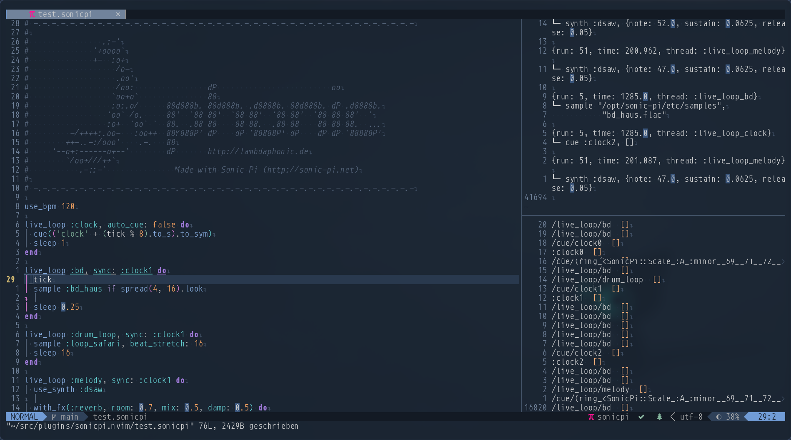

# sonicpi.nvim

This is a neovim plugin for [Sonic Pi]



## Features

This plugin is inspired by [sonicpi.vim](https://github.com/dermusikman/sonicpi.vim).

But
- fully implemented in lua.
- dynamic completion engine, powered by [nvim-cmp].
  - help texts and completions are parsed from [Sonic Pi]'s server code
- not dependend on external tools
- Compatible with [Sonic Pi] v4.0 and higher
  - can start and stop the [Sonic Pi] daemon process and sends the proper keep-alive packets in the background
- Can show logs and cues coming from [Sonic Pi]

## Installation

You will need at least version 0.6 of neovim with lua support and [nvim-cmp].
Use your preferred package/plugin manager to install this plugin.
With [packer.nvim](http://github.com/wbthomason/packer.nvim), this looks like:

```lua
use({
  'magicmonty/sonicpi.nvim',
  config = function()
    require('sonicpi').setup()
  end,
  requires = {¬
    'hrs7th/nvim-cmp',
    'kyazdani42/nvim-web-devicons'
  }
})
```

You have to set the directory to the Sonic Pi server, so that the plugin can read the documentation and language arguments for the completion engine.

### Configuration

The default configuration is as follows, you can override it with your own settings if you wish

```lua
require('sonicpi').setup({
  server_dir = "", -- It will try to find the SonicPi server
  mappings = {
    { 'n', '<leader>s', require('sonicpi.remote').stop, default_mapping_opts },
    { 'i', '<M-s>', require('sonicpi.remote').stop, default_mapping_opts },
    { 'n', '<leader>r', require('sonicpi.remote').run_current_buffer, default_mapping_opts },
    { 'i', '<M-r>', require('sonicpi.remote').run_current_buffer, default_mapping_opts },
  },
})
```

### LSP setup
If you want to use the LSP, then install solargraph correctly and add the following to the `on_init` callback of your lsp config:

```lua
local function on_init(client)
  ...

  require('sonicpi').lsp_on_init(client, { server_dir = '/opt/sonic-pi/app/server' })
end
```

also you need to configure solargraph to accept single files with


```
single_file = true
```

in the solargraph settings for your LSP setup

### CMP setup

If you want to use the completion engine, then you have to add the `sonicpi` source to your config:

```lua
require('cmp').setup({
  ...

  sources = {
    ...
    { name = 'sonicpi' }
    ...
  },
})
```

### Luasnip
This plugin has support for Luasnip. If you have luasnip istalled, then a selection of predefined snippets will be available.

Currently the following snippets are available:
- `clocks` -> makes a live loop, which acts as a selection of clocks where you can synchronize to
- `ll` -> makes a live loop
- `llc` -> makes a live loop, which synchronizes to a specific clock cue
- `bd` -> makes a live loop with a four on the floor base drum pattern
- `fx` -> makes a generic `with_fx` block
- `echo` -> makes a `with_fx` block with echo settings
- `reverb` -> makes a `with_fx` block with reverb settings

## Usage

You need to create a new file with a `.sonicpi` extension and open it in neovim.
Then you can use the LSP and completion engine including the snippets.

### Commands

- **SonicPiStartDaemon**: Starts the [Sonic Pi] server processes and keeps them alive
- **SonicPiStopDaemon**: Stops the [Sonic Pi] server processes
- **SonicPiHideLogs**: Hides the log windows but keeps the buffers intact (logging continues in the background)
- **SonicPiCloseLogs**: Closes all log windows and stops listening for log messages
- **SonicPiStopAndClose**: A combination of **SonicPiStopDaemon** and **SonicPiCloseLogs**
- **SonicPiSendBuffer**: Sends the content of the buffer to [Sonic Pi] for execution
- **SonicPiStop**: Stops the current run

### Default Mappings

| Mode | Key binding | Description        |
|:----:|-------------|--------------------|
|   n  | `<leader>r` | Run current buffer |
|   n  | `<leader>s` | Stop execution     |
|   i  | `<M-r>`     | Run current buffer |
|   i  | `<M-s>`     | Stop execution     |


[nvim-cmp]: https://github.com/hrs7th/nvim-cmp
[Sonic Pi]: https://sonic-pi.net
